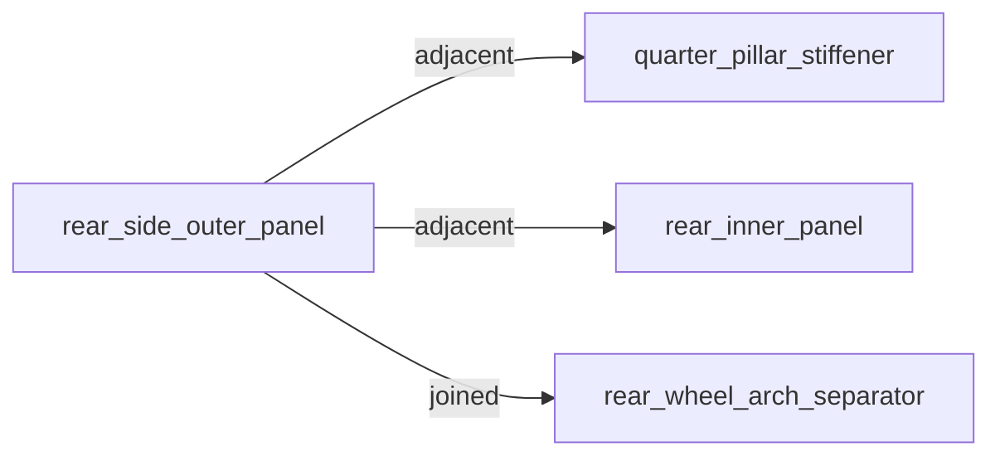

# RepairGraph

RepairGraph is a procedural intelligence platform. Its first commercial product serves collision repair.

It transforms customer-authorized OEM repair procedures into a canonical `OperationalModel` — and projects that model into insights, topology, workflow, replay, and reports.

The goal is not to replace OEM procedures or redistribute OEM documentation. The goal is a structured intelligence layer that answers: what matters, what is missing, what is blocked, and what should happen next.

## Platform Architecture

RepairGraph is structured as two distinct layers.

### Layer 1: Procedural Intelligence Platform

Domain-agnostic. Responsible for compiling customer-supplied procedural information into a canonical `OperationalModel`.

```
                Domain Documents
                        │
                        ▼
              Domain Adapter          ← collision, aviation, industrial...
                        │
                        ▼
          RepairGraph Compiler        ← domain-agnostic orchestration
                        │
                        ▼
             OperationalModel         ← canonical artifact
                        │
        ┌───────────────┼───────────────┐
        ▼               ▼               ▼
     Insights        Replay         Reports
```

Key packages:
- `src/repairgraph/core/` — `OperationalModel`, `RepairGraphCompiler`, `DomainAdapter`
- `src/repairgraph/adapters/` — `CollisionDomainAdapter` (and future domain adapters)

### Layer 2: Domain Products

Collision repair is the first product. Domain adapters translate domain-specific concepts (vehicles, OEMs, zones, calibration, corrosion) into generic compiler inputs.

Future domains may include aviation maintenance, industrial service, energy infrastructure, medical equipment, and other procedural verticals. Adding a new domain requires only a new adapter — the platform layer is unchanged.

## Current focus

RepairGraph v0.1 covers a narrow seed domain:

- OEM: Honda
- Model year: 2025
- Models: CR-V, Accord, Civic, Pilot, Odyssey
- Operation family: rear side outer panel / quarter panel replacement
- Supporting context: weld symbol definitions, corrosion protection, roof and side panel construction/material diagrams

## Repository structure

```
src/repairgraph/
  core/              # OperationalModel, RepairGraphCompiler, DomainAdapter interface
  adapters/          # CollisionDomainAdapter (and future domain adapters)
  extract/           # Text extraction pipeline (draft JSON from OEM text)
  graph/             # Graph builders and exporters
  topology/          # Spatial repair topology and visualization exports
  query/             # Query and cross-vehicle analysis
  inference/         # Repair intelligence: complexity, risk, supplements, gaps
  taxonomy/          # Controlled vocabularies and canonical aliases
  evidence/          # Provenance and trust semantics
  validate.py        # Schema validation for normalized data

examples/topology/
  accord_adjacency.mmd        # Example adjacency graph
  accord_visualization.json   # Example visualization payload
  accord_sequence_topology.json

data/normalized/honda/
  2025_accord/
  2025_civic/
  2025_crv/
  2025_odyssey/
  2025_pilot/
  corrosion_requirements.json
  joining_methods.json

schemas/
docs/
tests/
```

## Milestones

### Milestone 0.1 — Foundation (complete)
- Canonical ontology for Honda quarter panel operations
- Extraction pipeline from raw OEM text
- Normalized JSON schemas for repair procedures and vehicle structures
- Graph export (JSON + Mermaid) from extracted text

### Milestone 0.2 — Seed data corpus (complete)
- Normalized repair procedures for 5 Honda models
- Vehicle structure data for all 5 models
- OEM taxonomy files: corrosion requirements, joining methods

### Milestone 0.3 — Query module (complete)
- Query joining methods, dependencies, corrosion requirements, UHSS/HSS zones
- Cross-vehicle search and comparison
- Corpus motif analysis

### Milestone 0.4 — Graph model (complete)
- Graph builder from normalized JSON
- Multi-vehicle graph export
- Mermaid visualization export

### Milestone 0.5 — Inference layer (complete)
- Repair complexity scoring
- Material risk surfacing
- Supplement candidate inference
- Missing operation detection
- Procedure sequencing
- QA checklist generation
- Evidence/provenance trust semantics

### Milestone 0.6 — Spatial topology foundation (complete)
- Repair zoning and adjacency reasoning
- Structural grouping and operation-region mapping
- Visualization-ready topology payloads
- Sequence-aware topology exports
- Mermaid adjacency and operation overlay diagrams
- AR-ready topology infrastructure

## Installation

```bash
pip install -e .
```

## CLI commands

```bash
repairgraph-validate
repairgraph-query
repairgraph-infer
repairgraph-export-normalized-graph
repairgraph-export-draft
repairgraph-export-graph
repairgraph-topology
```

## Topology export

```bash
python -m repairgraph.topology.cli
```

Exports:
- topology JSON
- adjacency Mermaid graphs
- operation overlay Mermaid graphs
- visualization payloads

Output directory:

```text
data/extracted/topology/
```

## Example topology output

### Adjacency graph



### Visualization payload

```json
{
  "stage": 3,
  "name": "component_replacement",
  "zone_refs": [
    "rear_combination_adapter",
    "rear_wheel_arch_separator",
    "rear_pillar_separator"
  ]
}
```

RepairGraph topology exports are designed to support:
- repair visualization
- technician guidance
- operation zoning
- adjacency awareness
- sequence-aware workflows
- future AR-native repair execution systems

## Repair State Workflow Layer

The repair state workflow layer converts static procedure intelligence into
stateful repair execution tracking. It provides:

- **Event-sourced state** — append-only event ledger reconstructs workflow state
  at any point in the repair lifecycle
- **Phase and action tracking** — maps workflow progress to operation phases,
  individual actions, and spatial topology zones
- **QA gate blocking** — critical QA items prevent session completion
- **Blocker inspection** — helpers to query open blockers, phase blockers,
  and session completion blockers
- **Next-action recommendations** — advisory action IDs and resolved
  `ActionState` objects for the current workflow position
- **JSON export** — full state serialization with provenance metadata

### Modules

| Module | Purpose |
|---|---|
| `state/schema.py` | Dataclasses and allowed status constants |
| `state/initialize.py` | Build initial state from sequence, topology, and QA |
| `state/events.py` | Event factory functions and validation |
| `state/project.py` | Apply event ledger to produce projected state |
| `state/export_json.py` | Export RepairState to JSON-serializable dict |
| `state/blockers.py` | Blocker inspection utilities |
| `state/next_actions.py` | Next-action recommendation utilities |
| `state/cli.py` | Demo CLI for Accord state projection and export |
| `state/demo.py` | Shared deterministic Accord demo builder (used by CLI and API) |
| `state/ar_payload.py` | AR workflow payload builder |
| `state/ar_cli.py` | Demo CLI for AR payload export |
| `api/app.py` | FastAPI application wiring |
| `api/state_routes.py` | Internal state workflow API router |

### CLI

```bash
python -m repairgraph.state.cli
```

Initializes a Honda 2025 Accord repair state, applies a deterministic sample
event ledger, and writes the projected state to:

```text
data/extracted/state/accord_projected_state.json
```

### AR Workflow Payload

The AR workflow payload contract defines a stable, machine-readable payload that
AR technician interfaces, workflow UIs, and API clients can consume. It is built
on top of the repair state layer and is not a renderer, UI, or API endpoint.

```bash
python -m repairgraph.state.ar_cli
```

Output:

```text
data/extracted/state/accord_ar_workflow_payload.json
```

The payload includes per-zone overlay roles (active, blocked, completed, inactive),
per-action guidance roles (next recommended, active, blocked, completed), QA gate
roles (blocking open, passed, not applicable), blocker roles (critical open, open,
resolved), workflow summary counts, and active context lists — all as a flat,
JSON-serializable contract for downstream clients.

This is a payload contract for downstream AR/workflow clients, not a renderer or
certification system.

### Golden Path Demo

The fastest way to understand what RepairGraph does:

```bash
python -m uvicorn repairgraph.api.app:app --reload
```

Open: **http://localhost:8000/internal/demo**

A step-by-step guided experience — OEM intake → packet analysis → repair intelligence → interactive topology viewer → event replay → export. No presenter required. See [docs/GOLDEN_PATH_DEMO.md](docs/GOLDEN_PATH_DEMO.md) for full documentation.

### Internal State API

RepairGraph exposes its state workflow and AR payload intelligence through a
local FastAPI application. Endpoints are demo/internal only — no authentication,
no persistence, no external network calls.

**Start the server:**

```bash
uvicorn repairgraph.api.app:app --reload
```

**Endpoints:**

| Endpoint | Description |
|---|---|
| `GET /internal/demo` | **Golden path demo** — end-to-end guided experience (HTML) |
| `GET /internal/demo/payload` | Demo orchestration payload (JSON) |
| `GET /internal/state/accord/initial` | Initial (un-projected) Accord RepairState |
| `GET /internal/state/accord/projected` | Projected Accord state after deterministic demo event ledger |
| `GET /internal/state/accord/ar-payload` | AR workflow payload for the projected Accord state |
| `GET /internal/state/accord/summary` | Compact summary: session, workflow counts, blockers, next actions |
| `GET /internal/state/accord/topology-viewer` | **Interactive topology viewer** (self-contained HTML) |

**Example:**

```bash
curl http://localhost:8000/internal/state/accord/initial
curl http://localhost:8000/internal/state/accord/projected
curl http://localhost:8000/internal/state/accord/ar-payload
curl http://localhost:8000/internal/state/accord/summary
```

Or open in a browser: `http://localhost:8000/docs` for the interactive API explorer.

All endpoints return the same advisory workflow intelligence as the CLI tools,
generated from the same shared demo builder (`state/demo.py`). No files are
written on any request.

> **Advisory:** All API responses are advisory workflow projections derived
> from RepairGraph procedure data and explicit state events. These are local,
> internal demo endpoints — not a production API surface. No authentication is
> required. No repair certification or OEM compliance is implied.

### Workflow Visualization + Replay

RepairGraph now includes workflow visualization, state replay, and introspection
tooling for operational inspection and debugging.

#### Visualization CLI

```bash
python -m repairgraph.state.visualization_cli
```

Generates the projected Accord state and exports:

| File | Contents |
|---|---|
| `data/extracted/state/accord_workflow_visualization.json` | Combined introspection payload (JSON) |
| `data/extracted/state/accord_timeline.mmd` | Event sequence diagram (Mermaid) |
| `data/extracted/state/accord_phase_flow.mmd` | Phase progression flowchart (Mermaid) |
| `data/extracted/state/accord_blocker_flow.mmd` | Blocker graph (Mermaid) |
| `data/extracted/state/accord_zone_activation.mmd` | Zone activation states (Mermaid) |

Prints a concise summary: event count, open blockers, active phases, next actions.

#### Visualization endpoints

| Endpoint | Description |
|---|---|
| `GET /internal/state/accord/timeline` | Ordered event, phase, and action timelines |
| `GET /internal/state/accord/replay` | Event-by-event state replay with diffs |
| `GET /internal/state/accord/visualization` | Combined visualization payload with Mermaid diagrams |
| `GET /internal/state/accord/topology-viewer` | **Interactive topology viewer** — vehicle silhouette with live state, timeline replay, click-to-inspect |

The replay endpoint returns ordered snapshots — one per event applied — with
a lightweight state summary and change diff at each step. The visualization
endpoint returns the full introspection payload including all four Mermaid diagrams.

#### Mermaid outputs

- `accord_timeline.mmd` — `sequenceDiagram` showing which actor applied each
  event and to which target, with timestamps
- `accord_phase_flow.mmd` — `flowchart LR` showing all repair phases in sequence
  with status-coded colour
- `accord_blocker_flow.mmd` — `flowchart TD` showing each blocker node and what
  it blocks; open blockers in red, resolved in green
- `accord_zone_activation.mmd` — `flowchart LR` showing repair zones coloured by
  activation state (active=amber, complete=green, blocked=red, inactive=grey)

#### Interactive Topology Viewer

Open `http://localhost:8000/internal/state/accord/topology-viewer` in any browser.

The viewer is a self-contained HTML page (no CDN, no React, no external dependencies) that renders:

- **Vehicle silhouette** — color-coded repair regions showing live workflow state
- **Click-to-inspect** — click any region to see its procedures, QA gates, blockers, and next actions
- **Timeline replay** — scrub through the repair event history; the vehicle updates live
- **Filters** — toggle QA gates, blockers, completed regions, and dependency arrows
- **Export** — download the current viewer state as a standalone HTML file

See [docs/INTERACTIVE_TOPOLOGY_VIEWER.md](docs/INTERACTIVE_TOPOLOGY_VIEWER.md) for full documentation.

#### Replay and introspection

`replay_repair_state(initial_state, events)` projects state incrementally and
returns one `RepairState` snapshot per event applied. `build_state_diff` compares
two snapshots and returns a structured dict of changed statuses. Both are
deterministic, side-effect free, and suitable for operational debugging.

#### Advisory caveat

All repair state outputs are **advisory workflow projections** derived from
RepairGraph procedure data and explicit state events. They do not certify repair
completion, OEM compliance, or repair quality. OEM procedure verification and
qualified technician review are required before acting on any recommendation.

### Interactive Workflow Reports

RepairGraph generates self-contained, portable HTML reports from workflow
intelligence — openable locally in any browser without a server, framework,
or external dependencies.

#### Report CLI

```bash
python -m repairgraph.state.report_cli
```

Generates the deterministic Accord projected state and exports two HTML reports:

| File | Contents |
|---|---|
| `data/extracted/state/accord_workflow_report.html` | Workflow intelligence report with summary cards, timeline, blockers, QA gates, and Mermaid diagrams |
| `data/extracted/state/accord_replay_report.html` | Interactive replay inspector with step-by-step navigation |

Prints a concise summary: phase count, open blocker count, event count, replay snapshot count.

#### Report endpoint

```bash
curl http://localhost:8000/internal/state/accord/report
curl http://localhost:8000/internal/state/accord/report?view=replay
```

Returns a self-contained HTML response. Supports `?view=workflow` (default) and
`?view=replay` for the interactive replay inspector. No files are written.

#### Report sections

**Workflow report:**

- Advisory banner
- Session overview
- Workflow summary cards (phases, actions, QA gates, blockers, events, next actions)
- Active and blocked phases
- Next recommended actions
- Open blockers
- Open QA gates
- Event timeline
- Phase overview
- Action details
- Mermaid diagram sources (workflow timeline, phase flow, blocker flow, zone activation)

**Replay inspector:**

- Session overview
- Final state summary cards
- Interactive step navigator (vanilla JS, no frameworks)
- Per-step view: event details, state summary after event, state diff
- Replay step summary table
- Mermaid diagram sources for final projected state

#### Report portability

HTML reports are:
- Fully self-contained — no CDN, no external scripts, no network access
- Deterministic — same state always produces the same HTML
- Portable — open directly in any browser from disk
- Operational artifacts — not production UIs or dashboards

Mermaid diagram sources are embedded as styled code blocks. Paste any block
into a Mermaid-compatible tool to render the diagram.

> **Advisory:** All report content is advisory workflow intelligence derived
> from RepairGraph procedure data and explicit state events. Reports are local,
> portable artifacts — not certified repair records or OEM-compliance documents.
> Qualified technician review and OEM procedure verification are required before
> acting on any workflow recommendation.

## Repair Session Intake Pipeline

RepairGraph includes an OEM repair packet intake pipeline that ingests
unfamiliar repair documents, classifies them by role, detects OEM and
vehicle metadata, identifies what is present and what is missing, and
produces intake manifests and diagnostic HTML reports.

**OEM ownership boundary:** RepairGraph processes OEM repair information
supplied by authorized users/subscribers who have acquired the right to
use that information. RepairGraph is not an OEM document distribution
platform and does not redistribute OEM documentation.

### Intake philosophy

The intake pipeline is designed for safety, explainability, and graceful
degradation — not perfect parsing. It uses lightweight text heuristics,
not OCR or AI services. All outputs carry explicit confidence scores and
uncertainty signals. RepairGraph explains what it found, what it missed,
and what it cannot yet classify.

Metadata detection uses two evidence channels: **filename evidence** (high-signal
— OEM/model/year extracted from the filename itself) and **text evidence**
(from document body, with isolation penalty for weak isolated OEM mentions in
noisy long documents). Filename evidence takes priority. Packet-level OEM is
determined by filename consensus when the majority of files agree. Conflicts
between filename and text evidence generate `FILENAME_TEXT_DISAGREEMENT`
diagnostics. See `docs/INTAKE_PIPELINE.md` for the full hardening design.

### Supported input formats

- `.txt` — full confidence, primary format
- `.pdf` — heuristic byte-extraction, limited confidence; text-format docs preferred
- `.md`, `.json`, `.csv` — supported
- Other formats — classified with low confidence and warnings

### Intake CLI

```bash
python -m repairgraph.intake.cli path/to/repair/packet/
```

Or with individual files:

```bash
python -m repairgraph.intake.cli procedure.txt welding_specs.txt corrosion.txt
```

Terminal summary example:

```
Files processed:   3
OEM detected:      Toyota
Model detected:    camry
Year detected:     2023
OEM confidence:    80%
Roles found:       corrosion_protection, repair_procedure, welding
Missing roles:     materials
Readiness:         READY
```

Outputs written to `data/extracted/intake/`:

| File | Contents |
|---|---|
| `intake_manifest.json` | Full intake manifest with per-file classifications and diagnostics |
| `intake_report.html` | Self-contained HTML intake report |

### Intake HTML report

The HTML report includes:
- Advisory banner (OEM ownership boundary)
- Intake summary cards
- Detected packet metadata (OEM, model, year, operation)
- Document role coverage (found vs. missing)
- Per-file classification table with confidence indicators
- Diagnostics (errors, warnings, info)
- Missing role report with descriptions
- Readiness assessment

### Intake Upload UI

RepairGraph includes a local browser-based upload page for the intake pipeline.

**Start the server:**

```bash
python -m uvicorn repairgraph.api.app:app --reload
```

**Open in a browser:**

```
http://localhost:8000/internal/intake
```

The page provides:
- File picker and drag-and-drop zone for multiple OEM repair documents
- **Analyze Packet** — calls `POST /internal/intake/classify`, displays summary
  cards, detected OEM/model/year, role coverage, per-file classification table,
  and diagnostics inline on the page
- **View Full Report** — calls `POST /internal/intake/report`, opens the
  portable HTML intake report in a new browser tab
- Advisory/OEM ownership banner on every view

No files are stored. No authentication required. Local/internal use only.
No React, no CDN, no build system — vanilla HTML/CSS/JS only.

### Intake API endpoints

```bash
# Start the server
uvicorn repairgraph.api.app:app --reload

# Browser upload page
open http://localhost:8000/internal/intake

# Classify a packet (returns JSON manifest)
curl -F "files=@procedure.txt" -F "files=@welding.txt" \
     http://localhost:8000/internal/intake/classify

# Generate HTML intake report
curl -F "files=@procedure.txt" -F "files=@welding.txt" \
     http://localhost:8000/internal/intake/report
```

All endpoints accept multipart file uploads. No files are retained after
the response.

### Document roles

| Role | Description |
|---|---|
| `repair_procedure` | Main removal, installation, and replacement steps |
| `sectioning` | Panel sectioning guidelines and cut specifications |
| `welding` | Welding method specifications and technique requirements |
| `corrosion_protection` | Anti-corrosion treatment and sealer requirements |
| `materials` | Panel material classifications and handling restrictions |
| `dimensions` | Gap, clearance, and alignment specifications |
| `calibration` | ADAS sensor and camera calibration requirements |
| `precautions` | Safety precautions and hazard warnings |
| `unknown` | Document role could not be classified |

> **Advisory:** All intake outputs are heuristic estimates. They do not
> certify document completeness, OEM authenticity, or normalization readiness.
> RepairGraph processes OEM repair information supplied by authorized users.
> It is not an OEM document distribution platform.

## Running tests

```bash
python -m pytest tests/ -v
```

## Material classification

| Classification | Range |
|---|---|
| mild | below 340 MPa |
| HSS | 340–780 MPa |
| UHSS | 980 MPa and above |

UHSS components require special handling — spot welding is prohibited and MIG brazing is required at adjacent joins.

## What this is not

RepairGraph is not a PDF redistribution project, a generic document chatbot, or a replacement for OEM repair subscriptions. It is a transformation and reasoning layer for authorized repair information.
