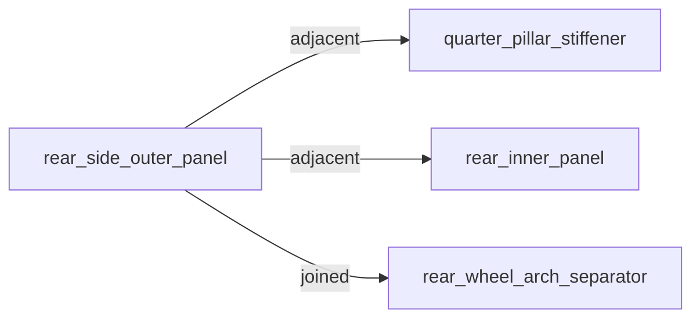

# RepairGraph

RepairGraph is a procedural intelligence engine for collision repair.

It transforms customer-authorized OEM repair procedures, construction/material diagrams, weld specifications, and corrosion requirements into structured, machine-readable repair graphs — and then reasons over those graphs to produce actionable intelligence.

The goal is not to replace OEM procedures or redistribute OEM documentation. The goal is a structured intelligence layer that answers questions static documents cannot: what joining methods are required, which components are likely missing from an estimate, what material constraints govern a repair, and how procedures compare across vehicles.

## Current focus

RepairGraph v0.1 covers a narrow seed domain:

- OEM: Honda
- Model year: 2025
- Models: CR-V, Accord, Civic, Pilot, Odyssey
- Operation family: rear side outer panel / quarter panel replacement
- Supporting context: weld symbol definitions, corrosion protection, roof and side panel construction/material diagrams

## Architecture

```
OEM repair procedure
    ↓
Extraction + normalization (Layer 2)
    ↓
RepairGraph canonical JSON (Layer 3)
    ↓
Node/edge graph (Layer 4)
    ↓
Query + inference (Layer 5)
    ↓
Spatial topology + visualization (Layer 6)
    ↓
Actionable repair intelligence
```

## Repository structure

```
src/repairgraph/
  extract/           # Text extraction pipeline (draft JSON from OEM text)
  graph/             # Graph builders and exporters
  topology/          # Spatial repair topology and visualization exports
  query/             # Query and cross-vehicle analysis
  inference/         # Repair intelligence: complexity, risk, supplements, gaps
  taxonomy/          # Controlled vocabularies and canonical aliases
  evidence/          # Provenance and trust semantics
  validate.py        # Schema validation for normalized data

examples/topology/
  accord_adjacency.mmd        # Example adjacency graph
  accord_visualization.json   # Example visualization payload
  accord_sequence_topology.json

data/normalized/honda/
  2025_accord/
  2025_civic/
  2025_crv/
  2025_odyssey/
  2025_pilot/
  corrosion_requirements.json
  joining_methods.json

schemas/
docs/
tests/
```

## Milestones

### Milestone 0.1 — Foundation (complete)
- Canonical ontology for Honda quarter panel operations
- Extraction pipeline from raw OEM text
- Normalized JSON schemas for repair procedures and vehicle structures
- Graph export (JSON + Mermaid) from extracted text

### Milestone 0.2 — Seed data corpus (complete)
- Normalized repair procedures for 5 Honda models
- Vehicle structure data for all 5 models
- OEM taxonomy files: corrosion requirements, joining methods

### Milestone 0.3 — Query module (complete)
- Query joining methods, dependencies, corrosion requirements, UHSS/HSS zones
- Cross-vehicle search and comparison
- Corpus motif analysis

### Milestone 0.4 — Graph model (complete)
- Graph builder from normalized JSON
- Multi-vehicle graph export
- Mermaid visualization export

### Milestone 0.5 — Inference layer (complete)
- Repair complexity scoring
- Material risk surfacing
- Supplement candidate inference
- Missing operation detection
- Procedure sequencing
- QA checklist generation
- Evidence/provenance trust semantics

### Milestone 0.6 — Spatial topology foundation (complete)
- Repair zoning and adjacency reasoning
- Structural grouping and operation-region mapping
- Visualization-ready topology payloads
- Sequence-aware topology exports
- Mermaid adjacency and operation overlay diagrams
- AR-ready topology infrastructure

## Installation

```bash
pip install -e .
```

## CLI commands

```bash
repairgraph-validate
repairgraph-query
repairgraph-infer
repairgraph-export-normalized-graph
repairgraph-export-draft
repairgraph-export-graph
repairgraph-topology
```

## Topology export

```bash
python -m repairgraph.topology.cli
```

Exports:
- topology JSON
- adjacency Mermaid graphs
- operation overlay Mermaid graphs
- visualization payloads

Output directory:

```text
data/extracted/topology/
```

## Example topology output

### Adjacency graph



### Visualization payload

```json
{
  "stage": 3,
  "name": "component_replacement",
  "zone_refs": [
    "rear_combination_adapter",
    "rear_wheel_arch_separator",
    "rear_pillar_separator"
  ]
}
```

RepairGraph topology exports are designed to support:
- repair visualization
- technician guidance
- operation zoning
- adjacency awareness
- sequence-aware workflows
- future AR-native repair execution systems

## Running tests

```bash
python -m pytest tests/ -v
```

## Material classification

| Classification | Range |
|---|---|
| mild | below 340 MPa |
| HSS | 340–780 MPa |
| UHSS | 980 MPa and above |

UHSS components require special handling — spot welding is prohibited and MIG brazing is required at adjacent joins.

## What this is not

RepairGraph is not a PDF redistribution project, a generic document chatbot, or a replacement for OEM repair subscriptions. It is a transformation and reasoning layer for authorized repair information.
