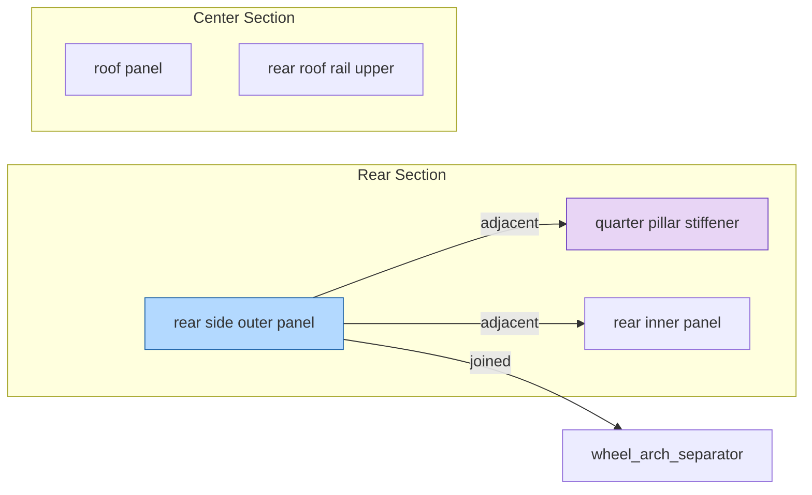

# Spatial Repair Topology — Architecture Notes

## Overview

The `repairgraph.topology` module introduces a structured spatial topology layer that transforms normalized repair procedures into spatially-aware graph representations.

This layer does **not** build AR UI or render any visualization. It produces the structured data objects that would eventually *enable* AR overlays, repair visualization, technician guidance, and operation zoning — as a separate concern, downstream from this infrastructure.

---

## Design Principles

| Principle | Implementation |
|-----------|---------------|
| Advisory-only | Every topology output carries OEM verification requirements and advisory language |
| Evidence-provenance | All relationships and regions include evidence objects with `source_type`, `basis`, `confidence` |
| Modular | Schema, builder, and exporters are fully decoupled |
| Deterministic | All outputs are derived from normalized source data; no generative or speculative behavior |
| Strongly typed | Dataclass definitions with `__post_init__` validation enforce allowed values |
| Infrastructure-first | No UI dependencies; outputs are plain dicts and strings |

---

## Architecture

```
src/repairgraph/topology/
├── schema.py              # Typed dataclass definitions
├── builder.py             # Builds TopologyGraph from normalized procedure + structure
├── export_json.py         # JSON serialization
├── export_mermaid.py      # Mermaid diagram generation
└── export_visualization.py # Visualization-ready graph payloads
```

---

## Schema

### `RepairZone`

Represents a named spatial region of the vehicle body.

```python
@dataclass
class RepairZone:
    zone_id: str                        # canonical snake_case identifier
    label: str                          # human-readable label
    zone_type: str                      # one of ALLOWED_ZONE_TYPES
    vehicle_section: str                # front | rear | center | left | right | full | unknown
    structural_tier: str                # outer_skin | inner_structure | reinforcement | substructure | unknown
    source_components: list[str]        # component names this zone was derived from
    material_classification: str | None # mild | HSS | UHSS, if known from structure data
    tensile_strength_mpa: int | None    # from vehicle structure material map
```

**Zone types:**

| Zone Type | Structural Tier | Examples |
|-----------|----------------|---------|
| `outer_panel` | outer_skin | rear_side_outer_panel, roof_panel |
| `inner_panel` | inner_structure | rear_inner_panel |
| `pillar` | substructure | rear_pillar_inner, d_pillar_inner |
| `rail` | substructure | rear_roof_rail_upper, rear_roof_rail_lower |
| `roofline` | outer_skin | roof_arch_a |
| `sill` | substructure | side_sill_panel |
| `wheel_arch` | reinforcement | wheel_arch_separator |
| `separator` | reinforcement | rear_pillar_separator |
| `stiffener` | reinforcement | quarter_pillar_stiffener, roof_side_rail_stiffener |
| `adapter` | reinforcement | rear_combination_adapter |
| `flange` | reinforcement | side_sill_extension_end_flange |
| `gutter` | inner_structure | rear_pillar_gutter |
| `extension` | reinforcement | wheel_arch_lower_extension |

### `ZoneRelationship`

Directed spatial relationship between two zones, derived from `spatial_relationships` in the normalized procedure.

```python
@dataclass
class ZoneRelationship:
    source: str        # zone_id
    relationship: str  # adjacent_to | joined_to | joins_to | inside_zone | structural_neighbor | sequence_dependency | belongs_to_group
    target: str        # zone_id
    evidence: dict     # RepairGraph evidence object
```

### `StructuralGroup`

Inferred structural assembly grouping zones with a shared naming prefix (minimum 2 members).

```python
@dataclass
class StructuralGroup:
    group_id: str           # e.g., rear_pillar_assembly
    label: str              # human-readable
    group_type: str         # pillar_assembly | rail_assembly | adapter_group | panel_group | ...
    member_zone_ids: list[str]
    evidence: dict
```

**Grouping logic:** Zones sharing a 2-token prefix (e.g., `rear_pillar_*`) are grouped into an assembly. This is a graph-relationship inference, not an OEM-stated structural fact.

### `OperationStage`

Maps a repair sequence phase to its relevant zones.

```python
@dataclass
class OperationStage:
    stage: int
    name: str          # e.g., pre_repair_inspection
    label: str         # e.g., Pre-Repair Inspection
    zone_refs: list[str]   # zone IDs touched in this phase
    actions: list[dict]    # action items from sequencing engine
    evidence: dict
```

### `OperationRegion`

Spatial region covering the zones activated by one operation stage. Suitable for zone-selection or spatial filtering.

```python
@dataclass
class OperationRegion:
    region_id: str
    label: str
    zone_refs: list[str]
    applicable_operations: list[str]
    sequence_phase: int | None
    evidence: dict
```

### `TopologyGraph`

Root container for all topology data.

```python
@dataclass
class TopologyGraph:
    zones: list[RepairZone]
    zone_relationships: list[ZoneRelationship]
    operation_regions: list[OperationRegion]
    structural_groups: list[StructuralGroup]
    operation_stages: list[OperationStage]
    meta: dict
    interpretation_note: str
```

---

## Zone Collection Logic

Zones are collected from all spatial sources in the normalized data:

1. `spatial_relationships[].source` and `spatial_relationships[].target` (from procedure)
2. `dependencies[].target` (inspection and replacement components)
3. `sectioning_locations[].zone` (cut position identifiers)
4. `structure_nodes[]` (from vehicle structure)
5. `materials[].component` (from vehicle structure material map)

Each unique ID is classified into zone attributes using keyword rules on the canonical name. Material data (classification, tensile strength) is attached when the zone ID matches a material component.

---

## Spatial Relationships

Relationship types derived from normalized procedures:

| Relationship | Source | Meaning |
|-------------|--------|---------|
| `adjacent_to` | spatial_relationships | Zones share a boundary or proximity |
| `joined_to` | spatial_relationships | Zones are mechanically joined |
| `belongs_to_group` | inferred | Zone is a member of a structural group |
| `structural_neighbor` | reserved | Inferred structural proximity (future) |
| `inside_zone` | reserved | Zone containment (future) |
| `sequence_dependency` | reserved | Sequencing dependency (future) |

---

## Visualization Export Layer

### `build_zone_map(topology)` → dict

Zone list indexed by type and vehicle section. Base layer for spatial overlays.

```json
{
  "zones": [{ "zone_id": "...", "zone_type": "...", "vehicle_section": "...", ... }],
  "by_type": { "outer_panel": [...], "stiffener": [...] },
  "by_section": { "rear": [...], "center": [...] },
  "meta": { "oem": "Honda", "model": "Accord", ... },
  "interpretation_note": "..."
}
```

### `build_adjacency_graph_payload(topology)` → dict

Nodes + directed edges + structural groups. Compatible with D3, Cytoscape, vis.js.

```json
{
  "nodes": [{ "id": "...", "label": "...", "type": "...", "tier": "..." }],
  "edges": [{ "source": "...", "target": "...", "relationship": "adjacent_to" }],
  "structural_groups": [{ "group_id": "...", "member_zone_ids": [...] }],
  ...
}
```

### `build_operation_overlay(topology)` → dict

Each zone annotated with which repair stages touch it. Suitable for step-by-step color coding.

```json
{
  "zones": [{
    "zone_id": "rear_pillar_gutter",
    "active_stages": [{ "stage": 1, "name": "pre_repair_inspection", ... }],
    "stage_count": 1
  }],
  "operation_stages": [...],
  ...
}
```

### `build_sequence_topology(topology)` → dict

Phase-by-phase spatial narrative combining operation sequence with zone attributes.

```json
{
  "phases": [{
    "phase": 1,
    "name": "pre_repair_inspection",
    "label": "Pre-Repair Inspection",
    "zones": [{ "zone_id": "rear_pillar_gutter", "zone_type": "gutter", ... }],
    "actions": [{ "action": "inspect_if_damaged", "target": "rear_pillar_gutter" }],
    "zone_count": 2
  }],
  ...
}
```

### `build_visualization_payload(topology)` → dict

All-in-one payload combining all four exports. Primary surface for downstream visualization consumers.

---

## Mermaid Export

### `build_adjacency_mermaid(topology)` → str

Zone adjacency diagram with:
- Zones grouped by vehicle section in subgraphs
- Spatial relationship edges with relationship labels
- Style directives per zone type (color-coded)

Example output fragment:



### `build_operation_overlay_mermaid(topology)` → str

Operation phase diagram with:
- Each repair phase as a named subgraph
- Zone references within each phase
- Sequence dependency edges between consecutive phases

---

## JSON Export

`topology_to_dict(topology)` produces a fully JSON-serializable dictionary via `dataclasses.asdict()`. All nested evidence objects are preserved.

---

## Usage

```python
from repairgraph.topology import build_topology_graph
from repairgraph.topology.export_visualization import build_visualization_payload
from repairgraph.topology.export_mermaid import build_adjacency_mermaid
from repairgraph.topology.export_json import topology_to_dict
from repairgraph.query.loader import load_procedure, load_vehicle_structure

proc = load_procedure("Honda", 2025, "Accord")
structure = load_vehicle_structure("Honda", 2025, "Accord")

topology = build_topology_graph(proc, structure)

# Visualization payload (JSON-serializable)
payload = build_visualization_payload(topology)

# Mermaid adjacency diagram
mermaid = build_adjacency_mermaid(topology)

# Raw dict for serialization
d = topology_to_dict(topology)
```

---

## Example Topology Outputs

### Zone Map (Accord)

```json
{
  "by_type": {
    "outer_panel": [
      { "zone_id": "rear_side_outer_panel", "vehicle_section": "rear", "structural_tier": "outer_skin" }
    ],
    "stiffener": [
      { "zone_id": "quarter_pillar_stiffener", "material_classification": "UHSS", "tensile_strength_mpa": 980 }
    ],
    "rail": [
      { "zone_id": "rear_roof_rail_upper", "material_classification": "UHSS", "tensile_strength_mpa": 1500 },
      { "zone_id": "rear_roof_rail_lower", "material_classification": "HSS", "tensile_strength_mpa": 590 }
    ]
  }
}
```

### Structural Groups (Accord)

```json
[
  {
    "group_id": "rear_pillar_assembly",
    "group_type": "pillar_assembly",
    "member_zone_ids": ["rear_pillar_gutter", "rear_pillar_gutter_lower", "rear_pillar_inner", "rear_pillar_separator"]
  },
  {
    "group_id": "rear_combination_assembly",
    "group_type": "adapter_group",
    "member_zone_ids": ["rear_combination_adapter", "rear_combination_adapter_lower"]
  },
  {
    "group_id": "rear_roof_assembly",
    "group_type": "rail_assembly",
    "member_zone_ids": ["rear_roof_rail_lower", "rear_roof_rail_upper"]
  }
]
```

### Operation Stage (Phase 1)

```json
{
  "phase": 1,
  "name": "pre_repair_inspection",
  "label": "Pre-Repair Inspection",
  "zones": [
    { "zone_id": "quarter_pillar_stiffener", "zone_type": "stiffener", "material_classification": "UHSS" },
    { "zone_id": "rear_pillar_gutter", "zone_type": "gutter", "structural_tier": "inner_structure" }
  ],
  "actions": [
    { "action": "inspect_if_damaged", "target": "rear_pillar_gutter" },
    { "action": "inspect_if_damaged", "target": "quarter_pillar_stiffener" }
  ]
}
```

---

## Trust Semantics

All topology outputs maintain RepairGraph's advisory-only trust model:

- Every `ZoneRelationship`, `OperationRegion`, `OperationStage`, and `StructuralGroup` carries a full RepairGraph evidence object (`source_type`, `basis`, `confidence`, `requires_oem_verification`, `interpretation`)
- `requires_oem_verification` is always `True`
- Confidence levels reflect the data source: `"high"` for explicitly declared spatial relationships from procedures, `"medium"` for inferred groupings and mapped operation regions
- `interpretation` is `"normalized_fact"` for declared relationships, `"advisory"` or `"graph_relationship"` for inferred content
- Every export payload carries `interpretation_note` with explicit advisory language
- Structural groups are inferred from naming patterns — these are advisory graph relationships, not OEM structural specifications

---

## Future AR Enablement

This layer is the structural prerequisite for AR-native repair workflows:

| Future Capability | Enabled By |
|------------------|-----------|
| AR zone overlays | `build_zone_map()` + zone type/section classification |
| Spatial step guidance | `build_sequence_topology()` + operation stages |
| Repair phase highlighting | `build_operation_overlay()` + `active_stages` per zone |
| 3D adjacency context | `build_adjacency_graph_payload()` nodes + edges |
| Technician zone focus | `operation_regions` filtered by current phase |
| UHSS proximity warnings | `RepairZone.material_classification` + adjacency edges |

None of these capabilities require changes to the topology layer itself — they are rendering and UX concerns that consume this data. The topology layer intentionally has no UI dependencies and no knowledge of rendering targets.

---

## Test Coverage

| Test File | Tests | Coverage |
|-----------|-------|---------|
| `test_topology_schema.py` | 18 | Schema validation, allowed values, dataclass defaults |
| `test_topology_builder.py` | 42 | Zone collection, classification, relationships, groups, stages, regions |
| `test_topology_export.py` | 44 | JSON serialization, Mermaid format, all visualization payloads |
