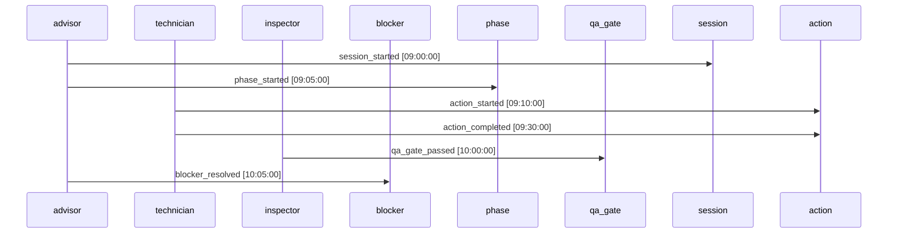
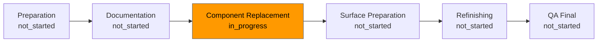
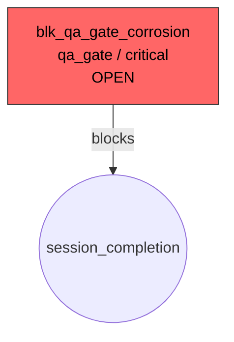
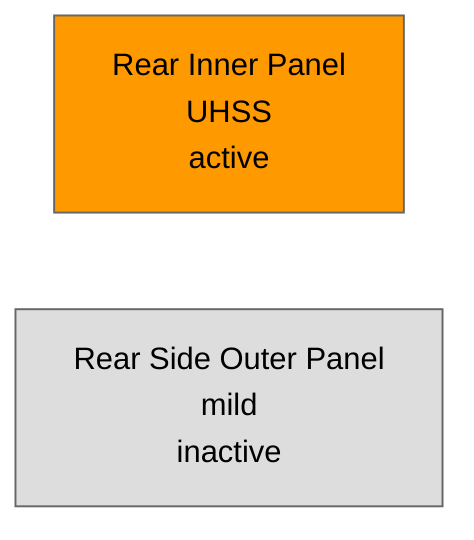

# Workflow Visualization + Replay

RepairGraph includes a workflow visualization and replay layer for operational
inspection, debugging, and demo use. It is built on top of the core repair state
model and does not require any UI, browser, database, or external service.

All outputs are advisory workflow intelligence. They do not certify repair
completion, OEM compliance, or repair quality.

---

## Timeline structure

Three timeline views are produced from a `RepairState` snapshot:

### Event timeline

`build_event_timeline(state) -> list[dict]`

Returns an ordered list of event ledger entries. Each entry includes:

```json
{
  "seq": 1,
  "event_id": "evt_demo_session_started",
  "timestamp": "2026-01-01T09:00:00Z",
  "event_type": "session_started",
  "actor": "advisor",
  "target_type": "session",
  "target_id": "session_2025_honda_accord_...",
  "notes": null,
  "evidence": null
}
```

Entries are ordered by event ledger append order (same as `state.events`).

### Phase timeline

`build_phase_timeline(state) -> list[dict]`

Returns one entry per phase, sorted by phase number. Each entry includes:

```json
{
  "phase": 3,
  "name": "component_replacement",
  "label": "Component Replacement",
  "status": "in_progress",
  "active_zones": [],
  "completed_actions": ["replace_component:rear_inner_panel"],
  "pending_actions": ["replace_component:quarter_pillar_stiffener"],
  "blocked_by": [],
  "related_blockers": ["blk_qa_gate_corrosion"],
  "advisory_notes": ["Verify corrosion protection before proceeding"]
}
```

### Action timeline

`build_action_timeline(state) -> list[dict]`

Returns one entry per action, sorted by (phase, action_id). Each entry includes:

```json
{
  "action_id": "replace_component:rear_inner_panel",
  "phase": 3,
  "action_type": "replace_component",
  "target": "rear_inner_panel",
  "status": "complete",
  "zone_refs": ["rear_inner_panel"],
  "requires_qa": true,
  "related_qa_gates": ["qa_corrosion_protection"],
  "evidence": null
}
```

### Timeline summary

`summarize_timeline(state) -> dict`

Returns a compact summary of the current workflow state:

```json
{
  "advisory": true,
  "total_events": 6,
  "session": {"status": "in_progress", "oem": "Honda", ...},
  "phases": {"total": 6, "active": 1, "completed": 0, "blocked": 0},
  "actions": {"total": 16, "completed": 1, "in_progress": 0, "blocked": 0, "pending": 15},
  "open_qa_gates": 18,
  "blocking_qa_gates": 18,
  "open_blockers": 15,
  "critical_blockers": 0,
  "next_actions": ["replace_component:front_upper_edge"],
  "next_action_targets": ["front_upper_edge"]
}
```

---

## Replay concepts

### Incremental projection

`replay_repair_state(initial_state, events) -> list[RepairState]`

Returns one `RepairState` snapshot per event applied. Snapshot `i` reflects
the accumulated state after events `[0..i]`.

```python
from repairgraph.state.demo import build_accord_initial_state, build_accord_demo_events
from repairgraph.state.replay import replay_repair_state

initial = build_accord_initial_state()
events = build_accord_demo_events(initial)
snapshots = replay_repair_state(initial, events)

# snapshots[0] has 1 event (session_started)
# snapshots[-1] has all 6 events
```

Properties:
- Deterministic — same inputs always produce the same outputs
- Side-effect free — initial state is never mutated
- Snapshots are deep copies — safe to inspect without affecting each other

### State diffing

`build_state_diff(previous_state, current_state) -> dict`

Compares two snapshots and returns a structured dict of status changes:

```json
{
  "session_status": {"previous": "not_started", "current": "in_progress"},
  "phases": {
    "component_replacement": {
      "previous_status": "not_started",
      "current_status": "in_progress"
    }
  },
  "actions": {
    "replace_component:rear_inner_panel": {
      "previous_status": "pending",
      "current_status": "complete"
    }
  },
  "qa_gates": {...},
  "blockers": {...},
  "next_recommended_actions": {"previous": [], "current": ["replace_component:..."]}
}
```

Returns `{}` when no changes are detected.

`summarize_state_diff(diff) -> dict`

Converts a diff to a human-readable summary:

```json
{
  "change_count": 4,
  "changed_entities": ["session_status", "phases", "actions"],
  "changes": [
    "session: not_started → in_progress",
    "phase component_replacement: not_started → in_progress",
    "action replace_component:rear_inner_panel: pending → complete"
  ],
  "has_session_change": true,
  "has_action_changes": true,
  ...
}
```

---

## Visualization payload sections

`build_workflow_visualization_payload(state) -> dict`

The combined visualization payload schema is `repairgraph.workflow_visualization`
v0.1. Top-level sections:

| Section | Contents |
|---|---|
| `session` | Session ID, OEM, year, model, operation, status |
| `workflow_summary` | Phase/action/gate/blocker/event counts |
| `timelines.summary` | Compact status summary |
| `timelines.events` | Full event timeline entries |
| `timelines.phases` | Phase timeline entries |
| `timelines.actions` | Action timeline entries |
| `replay_metadata` | Event IDs, types, timestamps; pointer to replay endpoint |
| `visualization.sections` | List of Mermaid section names |
| `visualization.mermaid` | Mermaid diagram strings (all four types) |
| `active_context` | Active/blocked phase IDs, zone IDs, next action IDs |
| `blockers` | Open/resolved blocker summary (from `summarize_blockers`) |
| `next_actions` | Next action summary (from `summarize_next_actions`) |

---

## Mermaid examples

### Workflow timeline (sequenceDiagram)



### Phase flow (flowchart LR)



### Blocker flow (flowchart TD)



### Zone activation (flowchart LR)



---

## Advisory

All workflow visualization and replay outputs are **advisory workflow projections**
derived from RepairGraph procedure data and explicit state events. They do not
certify repair completion, OEM compliance, or repair quality. OEM procedure
verification and qualified technician review are required before acting on any
recommendation.
